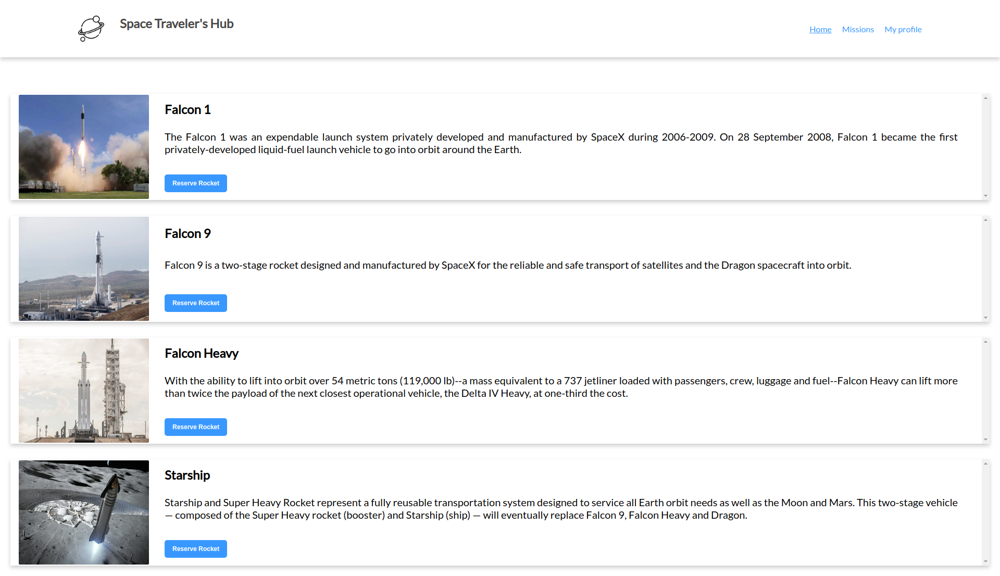

# Space Travelers Hub

## Live preview 
  ## Heroku [link](https://murmuring-hollows-84269.herokuapp.com/).
  ## Netlify [link](https://621a34b47f4ddae9c99da761--hopeful-euclid-a4fd8a.netlify.app/).

## Screenshots

## Contents
* [Home/Rockets](#home)
* [Missions](#missions)
* [My Profile](#myprofile)

## General info
 In this project we used the real live data from the official spaceX API. It is web application for a company that provides commercial and scientific space travel.services.The application will allow users to book rockets and join selected space missions.from the SpaceX API.

 ## Technologies
Project is created with:
* React 
* Redux
* JSX
* CSS
* API

## Setup
To run this project, install it locally using:
- cd Desktop
- git clone https://github.com/Nuri1977/space-travelers-hub.git
- cd space-travelers-hub
- npm install
- npm start 

## Author 1

👤 **Dejan Vujovic**

- Github : [@VuDej](https://github.com/VuDej)
- Twitter: [@DejanVuj](https://twitter.com/DejanVuj)
- LinkedIn : [@Dejan-Vujovic](https://www.linkedin.com/in/dejan-vujovic-5a0672225/)

## Author 2

👤 **Nuri Lacka**

- GitHub: [@Nuri1977](https://github.com/Nuri1977)
- Twitter: [@Lackanuri](https://twitter.com/LackaNuri)
- LinkedIn: [@nurilacka](https://www.linkedin.com/in/nuri-lacka-7141b01ba/)

## Available Scripts

In the project directory, you can run:

### `npm start`

Runs the app in the development mode.\
Open [http://localhost:3000](http://localhost:3000) to view it in your browser.

The page will reload when you make changes.\
You may also see any lint errors in the console.

### `npm test`

Launches the test runner in the interactive watch mode.\
See the section about [running tests](https://facebook.github.io/create-react-app/docs/running-tests) for more information.

### `npm run build`

Builds the app for production to the `build` folder.\
It correctly bundles React in production mode and optimizes the build for the best performance.

The build is minified and the filenames include the hashes.\
Your app is ready to be deployed!

See the section about [deployment](https://facebook.github.io/create-react-app/docs/deployment) for more information.

### `npm run eject`

**Note: this is a one-way operation. Once you `eject`, you can't go back!**

If you aren't satisfied with the build tool and configuration choices, you can `eject` at any time. This command will remove the single build dependency from your project.

Instead, it will copy all the configuration files and the transitive dependencies (webpack, Babel, ESLint, etc) right into your project so you have full control over them. All of the commands except `eject` will still work, but they will point to the copied scripts so you can tweak them. At this point you're on your own.

You don't have to ever use `eject`. The curated feature set is suitable for small and middle deployments, and you shouldn't feel obligated to use this feature. However we understand that this tool wouldn't be useful if you couldn't customize it when you are ready for it.

## 🤝 Contributing

Contributions, issues, and feature requests are welcome!

Feel free to check the [issues page]().

## Show your support

Give a ⭐️ if you like this project!

## Acknowledgments

- A special thanks to Microverse.

## 📝 License

This project is [MIT](LICENSE) licensed.

## Contact
Created by [@VuDej](https://github.com/VuDej) and [@Nuri1977](https://github.com/Nuri1977)
